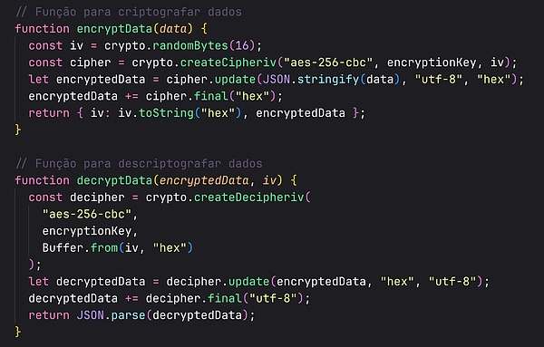
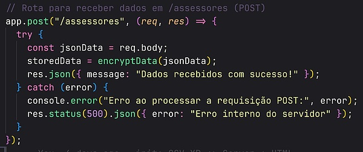

# Documentação do Ambiente Node.js - CSV XP

Este documento descreve o funcionamento e as rotas do servidor Node.js fornecido, que utiliza o framework Express para criar uma API REST básica. Este servidor permite a recepção, armazenamento e recuperação de dados relacionados a assessores.

## Requisitos do Sistema

- [Node.js](https://nodejs.org/) (v14.x ou superior)
- [npm](https://www.npmjs.com/) (gerenciador de pacotes para Node.js)

## Instalação

1. Clone o repositório:

   ```bash
   git clone https://github.com/ardassejose/csv-xp.git
   ```

2. Instale as dependências:

   ```bash
   npm install
   ```

## Configuração

O servidor está configurado para rodar na porta `3000` por padrão. Se necessário, você pode modificar essa configuração alterando a variável `port` no arquivo `server.js`.

## Uso

Execute o servidor com o seguinte comando:

```bash
npm start
```

O servidor será iniciado e estará disponível em `http://localhost:3000`.

## Rotas

### POST /assessores

Esta rota permite a adição de dados de assessores. Os dados devem ser enviados no corpo da requisição no formato JSON.

### GET /assessores

Esta rota retorna os dados armazenados relacionados aos assessores.

### DELETE /delete-assessores

Esta rota deleta os dados armazenados sobre os assessores.

## Middlewares

### CORS

O servidor utiliza o middleware `cors` para lidar com a política de mesma origem (Same-Origin Policy). Ele permite solicitações de qualquer origem e configura os cabeçalhos CORS apropriados.

### Body Parser

O middleware `body-parser` é utilizado para analisar o corpo das requisições como JSON, limitando o tamanho para 10 MB.

## Em desenvolvimento

## Criptografia de JSON

Para aprimorar a segurança dos dados, a biblioteca `crypto` foi inserida para criptografar e decodificar o JSON.



- // Rota para receber a requisição do body e encriptar as informações



## Notas

- Certifique-se de ajustar as configurações de CORS de acordo com os requisitos de segurança do seu aplicativo.
- Este é um exemplo simples e pode precisar ser adaptado para requisitos específicos do projeto.
- Lembre-se de implementar medidas de segurança adequadas para ambientes de produção.
- Consulte a [documentação do Express](https://expressjs.com/) para mais detalhes sobre o framework.

Ao seguir este guia, você deve ser capaz de configurar e utilizar o servidor Node.js fornecido.